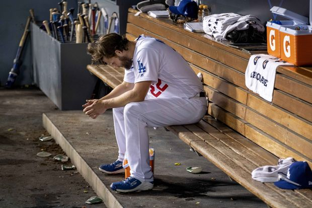

```{r setup, include=FALSE}
knitr::opts_chunk$set(echo = TRUE)
knitr::opts_chunk$set(fig.width=12, fig.height=8)
```
# Introduction
Clayton Kershaw has been considered as one of the greatest pitchers during this generation. His accolades of 8 time All-Star, 3 time National League Cy Young Award Winner, and 2014 National League MVP contribute to this title. His performace since his debut have backed up the belief that he is a future hall of famer.   
  
Although he is considered one of the greatest pitchers, Kershaw has a tendency to 'choke' during the post season. His ERA has consistenly been higher in the post season when comparing it to his regular season ERA. This change in mentality or skill during the post season came to make a huge difference for the Dodgers in the fifth game of the NLDS against the Nationals. Before Kershaw pitched in the seventh inning, the score was 3-1 in favor of the Dodgers. When called to the mound, Kershaw pitched two homeruns back to back in the eighth, tieing the score for the Nationals. This ultimately led to a shift in momentum and a grand slam win for the Nationals. 

This type of error is so rare of in the post season, especially for an experienced veteran such as Kershaw. Looking at Kershaw's ERA data throughout his seasons, we will try to see if he is really that much worse during the post season.

# Code {.tabset .tabset-fade .tabset-pills}

## Loading Libraries and Filtering Data
```{r message=FALSE, warning=FALSE}
#Loading Libraries
library(dplyr)
library(ggplot2)
library(tibble)

#Importing CSV for Kershaw
regular = read.csv('kershaw_regular.csv', header = TRUE)
post = read.csv('kershaw_post.csv', header = TRUE)

#Making Data into Tibbles
regular = as_tibble(regular)
post = as_tibble(post)

#Filtering out data  to years Dodgers went to playoffs
regular = dplyr::select(regular, X, ERA, AVG)
regular = filter(regular, X != 2010, 2011, 2012)
regular = rename(regular, Season = X)

post = dplyr:: select(post, Season, ERA, AVG)

#Merging data frames
kershaw = merge(regular, post, by = 'Season')
kershaw = rename(kershaw, era_reg = ERA.x, avg_reg = AVG.x, era_post = ERA.y, avg_post = AVG.y, season = Season)

#Filtering out Career Average
kershaw_data = filter(kershaw, season != 'MLB Career')
```

## Creating Plots {.tabset .tabset-fade .tabset-pills}

### Kershaw Era
```{r}
kershaw_era_plot = ggplot(data = kershaw_data, aes(x = season, group = 1)) + 
  geom_point(aes(y = era_reg, color = 'Regular Season'), size = 2) + 
  geom_line(aes(y = era_reg, color = 'Regular Season')) +
  geom_point(aes(y = era_post, color = 'Post Season'), size = 2) +
  geom_line(aes(y = era_post, color = 'Post Season')) +
  xlab('Season') +
  ylab('ERA') + 
  ggtitle('Clayton Kershaw ERA During Regular and Post Season') +
  theme(axis.title = element_text(size = 15, face = 'bold'),
        plot.title = element_text(size = 18, hjust = 0.5)) 
```

### Batting Average Against Kershaw
```{r}
avg_plot = ggplot(data = kershaw_data, aes(x = season, group = 1)) + 
  geom_point(aes(y = avg_reg, color = 'Regular Season'), size = 2) + 
  geom_line(aes(y = avg_reg, color = 'Regular Season')) +
  geom_point(aes(y = avg_post, color = 'Post Season'), size = 2) +
  geom_line(aes(y = avg_post, color = 'Post Season')) +
  xlab('Season') + 
  ylab('AVG') + 
  ggtitle('MLB Batting Average Against Kershaw') +
  theme(axis.title = element_text(size = 15, face = 'bold'),
        plot.title = element_text(size = 18, hjust = 0.5))
```

```{r, include = FALSE}
mlb_era = read.csv('mlb_avg_era.csv', header = TRUE)

#Turning dataframe into Tibble
mlb_era = as_tibble(mlb_era)
mlb_era$season = as.factor(mlb_era$season)
```

### Average MLB ERA
```{r}
mlb_era_avg_plot = ggplot(data = mlb_era, aes(x = season, group = 1)) + geom_line(aes(y = reg_era, color = 'Regular Season')) + 
  geom_line(aes(y = post_era, color = 'Post Season')) + geom_point(aes(y = reg_era, color = 'Regular Season'), size = 2) +
  geom_point(aes(y = post_era, color = 'Post Season'), size = 2) +
  xlab('Season') + ylab('ERA') + ggtitle('MLB Average ERA in Regular and Post Season') +
  theme(axis.title = element_text(size = 15, face = 'bold'),
        plot.title = element_text(size = 18, hjust = 0.5)) 
```

### Kershaw and MLB ERA Regular
```{r}
mlb_kershaw_df = merge(mlb_era, kershaw_data, by = 'season')
mlb_kershaw_df = rename(mlb_kershaw_df, kershaw_era_reg = era_reg, kershaw_era_post = era_post)
mlb_kershaw_df$season = as.factor(mlb_kershaw_df$season)

mlb_kershaw_era_reg_plot = ggplot(data = mlb_kershaw_df, aes(x = season, group = 1)) + 
  geom_line(aes(y = reg_era, color = 'MLB')) + 
  geom_line(aes(y = kershaw_era_reg, color = 'Kershaw')) + 
  geom_point(aes(y = kershaw_era_reg, color = 'Kershaw'), size = 2) +
  geom_point(aes(y = reg_era, color = 'MLB'), size = 2) +
  xlab('Season') + 
  ylab('ERA') +
  ggtitle("Average MLB ERA Compared to Kershaw's ERA Regular Season") +
  theme(axis.title = element_text(size = 15, face = 'bold'),
        plot.title = element_text(size = 18, hjust = 0.5)) 
```

### Kershaw and MLB ERA Post
```{r}
mlb_kershaw_era_post_plot = ggplot(data = mlb_kershaw_df, aes(x = season, group = 1)) + 
  geom_line(aes(y = post_era, color = 'MLB')) + 
  geom_line(aes(y = kershaw_era_post, color = 'Kershaw')) + 
  geom_point(aes(y = kershaw_era_post, color = 'Kershaw'), size = 2) +
  geom_point(aes(y = post_era, color = 'MLB'), size = 2) +
  xlab('Season') +
  ylab('ERA') +
  ggtitle("Average MLB ERA Compared to Kershaw's ERA Post Season") +
  theme(axis.title = element_text(size = 15, face = 'bold'),
        plot.title = element_text(size = 18, hjust = 0.5))
```


# Plots {.tabset .tabset-fade .tabset-pills}

## Kershaw ERA
```{r, echo = FALSE}
kershaw_era_plot
```

```{r, include = FALSE}
kershaw_avg_era_regular = round(mean(kershaw_data$era_reg), 2)
kershaw_avg_era_post = round(mean(kershaw_data$era_post), 2)
```
  
It is clear when plotting Kershaw's ERA during the regular season and post season, that his skills during the post season don't match up to his regular season. His ERA during the regular season are quite consistent, maintaining an average ERA of `r kershaw_avg_era_regular`, but his post season average ERA is more sporratic, with an average of `r kershaw_avg_era_post`. Giving up more than 2 runs on average during the post season can make or break the game. 

## Batting Average Against Kershaw
```{r, echo = FALSE}
avg_plot
```

```{r, include = FALSE}
batting_avg_diff = mean(kershaw_data$avg_post - kershaw_data$avg_reg)
mean(kershaw_data$avg_reg)
mean(kershaw_data$avg_post)
```

Players usually tend to have a hard time hitting against Kershaw due to his unique pitching style and his ability to spin his 4-seam fast ball and his curveball. In some seasons, players had a harder time hitting against Kershaw during the post season than during the regular season, but during most seasons, the batting average against Kershaw was higher in the post season. Overall, throughout the seasons that Kershaw has made it to the playoffs, player batting average against him has been higher by `r batting_avg_diff`, on average, during the post season.

## MLB Average ERA
```{r, echo = FALSE}
mlb_era_avg_plot
```
  
Historically, the ERA of pitchers during the regular season tends to be higher than during the post season.

## Kershaw Against MLB Average ERA
```{r, echo = FALSE}
gridExtra::grid.arrange(mlb_kershaw_era_reg_plot, mlb_kershaw_era_post_plot)
```
```{r, include = FALSE}
mlb_avg_era_reg = mean(mlb_kershaw_df$reg_era)
mlb_avg_era_post = mean(mlb_kershaw_df$post_era)
```

When comparing the ERAs of pitchers to Kershaw during the regular season, it is clear that he is in a different class. Even during his first season in the major league, he pitched at a slightly lower ERA than the rest of the league. While the league has had an ERA average of `r mlb_avg_era_reg`, during the years the Dodgers made it to the playoffs, Kershaw has held an average ERA of `r kershaw_avg_era_regular`.

When it comes to the post season, the story changes completely. From looking at the graph of average mlb ERA compared to Kershaw's ERA during the post season, Clayton Kershaw's ERA tends to either be slightly above the MLB average or massively higher. 

While the MLB average ERA during the post season is `r mlb_avg_era_post`, Kershaw's ERA during the post season is `r kershaw_avg_era_post`. On average, Kershaw tends to pitch one more run than the rest of the MLB pitchers.

# Conclusion
From the data we have collected and observed, Clayton Kershaw does not perform as well as he does during the regular season in the post season. His ERA is higher during the post season and the average ERA of all pitchers in the post season is lower than his. It is clear that something during the post season is affecting Kershaw's pitching ability.

Even after all his playoff misfortunes, Kershaw is still one of the greatest pitchers to ever pitch in the league, he still maintains the lowest ERA average during the regular season of all current players, and he will still probably be a member of the Hall of Fame. A pitcher of his caliber would have probably won a World Series title with so many post season apperances. The data confirms what we see; Clayton Kershaw is not the same pitcher during the post season as he is in the regular season. Is it a mental block? Maybe. All we know is that if the Dodgers want to win a World Series, something has to be done about Kershaw's post season performance.




